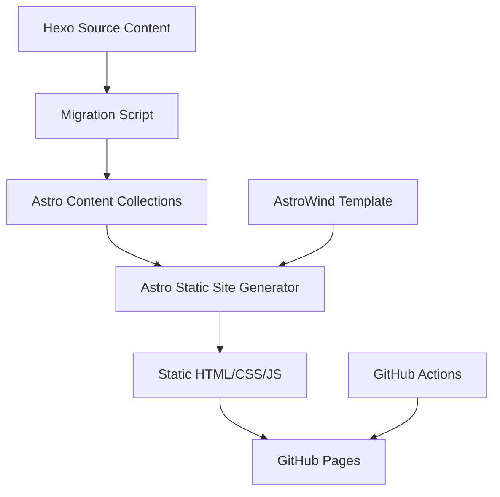

# Design Document

## Overview

This design outlines the technical approach for creating a modern blog using Astro with the AstroWind template and migrating content from an existing Hexo-based website. The solution will leverage Astro's static site generation capabilities, implement content collections for blog posts, and provide automated deployment to GitHub Pages.

## Architecture

### High-Level Architecture



### Technology Stack

- **Framework**: Astro (latest version)
- **Template**: AstroWind from <https://github.com/arthelokyo/astrowind>
- **Content Management**: Astro Content Collections
- **Styling**: Tailwind CSS (included with AstroWind)
- **Deployment**: GitHub Actions → GitHub Pages
- **Package Manager**: npm

## Components and Interfaces

### Core Components

#### 1. Content Collection Schema

```typescript
// src/content/config.ts
import { defineCollection, z } from 'astro:content';

const blogCollection = defineCollection({
  type: 'content',
  schema: z.object({
    title: z.string(),
    description: z.string().optional(),
    publishDate: z.date(),
    updatedDate: z.date().optional(),
    categories: z.array(z.string()).default([]),
    tags: z.array(z.string()).default([]),
    draft: z.boolean().default(false),
    image: z.string().optional(),
  }),
});
```

#### 2. Page Components

- **Home Page**: Landing page with recent posts and featured content
- **Archive Page**: Chronological listing of all posts with pagination
- **About Page**: Static content about the blog owner
- **Category Pages**: Dynamic pages for each category
- **Tag Pages**: Dynamic pages for each tag
- **Blog Post Pages**: Individual post rendering with metadata and Giscus comments

#### 3. Navigation Components

- **Header Navigation**: Main site navigation
- **Category/Tag Navigation**: Filtering and browsing components
- **Pagination**: For archive and category/tag pages

#### 4. Comment Component

- **Giscus Integration**: GitHub Discussions-based commenting system
- **Authentication**: GitHub OAuth for user authentication
- **Comment Display**: Threaded comment display with reactions

### Migration Components

#### 1. Content Parser

```typescript
interface HexoPost {
  title: string;
  date: string;
  categories: string[];
  tags: string[];
  content: string;
  // Additional Hexo-specific metadata
}

interface AstroPost {
  title: string;
  publishDate: Date;
  categories: string[];
  tags: string[];
  content: string;
  // Astro-compatible frontmatter
}
```

#### 2. Migration Script

- Parse Hexo markdown files from `/Users/jbrinkman/projects/joe.brinkman.hexo`
- Convert frontmatter format from Hexo to Astro
- Preserve content structure and formatting
- Generate category and tag collections

## Data Models

### Blog Post Model

```typescript
interface BlogPost {
  id: string;
  slug: string;
  title: string;
  description?: string;
  publishDate: Date;
  updatedDate?: Date;
  categories: string[];
  tags: string[];
  draft: boolean;
  image?: string;
  content: string;
}
```

### Category/Tag Models

```typescript
interface Category {
  name: string;
  slug: string;
  count: number;
  posts: BlogPost[];
}

interface Tag {
  name: string;
  slug: string;
  count: number;
  posts: BlogPost[];
}
```

## File Structure

```
src/
├── components/
│   ├── blog/
│   │   ├── PostCard.astro
│   │   ├── PostList.astro
│   │   ├── PostMeta.astro
│   │   └── GiscusComments.astro
│   ├── navigation/
│   │   ├── Header.astro
│   │   ├── CategoryNav.astro
│   │   └── TagNav.astro
│   └── ui/
│       └── Pagination.astro
├── content/
│   ├── blog/
│   │   └── [migrated-posts].md
│   └── config.ts
├── layouts/
│   ├── BaseLayout.astro
│   ├── BlogPost.astro
│   └── ArchivePage.astro
├── pages/
│   ├── index.astro
│   ├── archive.astro
│   ├── about.astro
│   ├── categories/
│   │   ├── index.astro
│   │   └── [category].astro
│   ├── tags/
│   │   ├── index.astro
│   │   └── [tag].astro
│   └── blog/
│       └── [slug].astro
└── utils/
    ├── blog.ts
    └── migration.ts
```

## Error Handling

### Migration Error Handling

- **File Reading Errors**: Log missing or corrupted files, continue with available content
- **Parsing Errors**: Validate frontmatter, provide defaults for missing fields
- **Content Conversion**: Handle special characters and formatting edge cases

### Runtime Error Handling

- **404 Pages**: Custom 404 page for missing content
- **Build Errors**: Comprehensive error logging for debugging
- **Image Loading**: Fallback handling for missing images

## Testing Strategy

### Unit Testing

- Content collection schema validation
- Migration script functionality
- Utility functions for blog operations

### Integration Testing

- End-to-end migration process
- Page generation and routing
- Content rendering accuracy

### Manual Testing

- Visual regression testing against AstroWind template
- Cross-browser compatibility
- Mobile responsiveness
- Performance benchmarking

## Deployment Configuration

### GitHub Actions Workflow

```yaml
name: Deploy to GitHub Pages
on:
  push:
    branches: [main]
  workflow_dispatch:

jobs:
  build:
    runs-on: ubuntu-latest
    steps:
      - uses: actions/checkout@v4
      - uses: actions/setup-node@v4
        with:
          node-version: '18'
          cache: 'npm'
      - run: npm ci
      - run: npm run build
      - uses: actions/upload-pages-artifact@v2
        with:
          path: ./dist
  
  deploy:
    needs: build
    runs-on: ubuntu-latest
    environment:
      name: github-pages
      url: ${{ steps.deployment.outputs.page_url }}
    steps:
      - uses: actions/deploy-pages@v2
        id: deployment
```

### Astro Configuration

```javascript
// astro.config.mjs
import { defineConfig } from 'astro/config';
import tailwind from '@astrojs/tailwind';

export default defineConfig({
  site: 'https://[username].github.io',
  base: '/[repository-name]',
  integrations: [tailwind()],
  markdown: {
    shikiConfig: {
      theme: 'github-dark',
    },
  },
});
```

## Performance Considerations

- **Static Generation**: All pages pre-built at build time
- **Image Optimization**: Astro's built-in image optimization
- **Code Splitting**: Automatic JavaScript bundling and splitting
- **CSS Optimization**: Tailwind CSS purging and minification
- **Caching Strategy**: Leverage GitHub Pages CDN caching

## Security Considerations

- **Content Sanitization**: Ensure migrated content is properly sanitized
- **Dependency Management**: Regular updates of Astro and dependencies
- **Build Process**: Secure GitHub Actions workflow with minimal permissions
- **Static Assets**: No server-side vulnerabilities due to static nature
